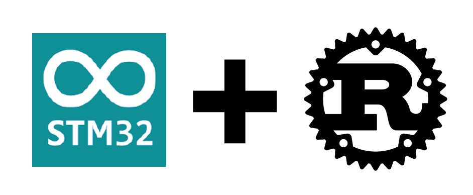

## Motivation

I love writing [Arduino code for STM32
microcontrollers](https://github.com/stm32duino) but wanted to expand my skill
set to the awesome Rust programming language.  Having looked into [Embedded
Rust](https://docs.rust-embedded.org/book/), I concluded that the  level of
Rust knowledge required was beyond my current ability to understand and modify.
(Also, because much of the Rust code required to replace the Arduino code for peripherals,
serial comms and the like must declared ```unsafe```,  I couldn't see a big advantage
to giving up the convenience of Arduino to move entirely to Rust.) To keep the
best of both worlds &ndash; the simplicity of the Arduino approach and the
safety of Rust &ndash; I came up with this minimal example of how you
can call Rust code from an Arduino sketch on an STM32 microcontroller.  

## Example 

The very simple example I am using is adapted from Amir Shrestha's
[blog post](https://amirkoblog.wordpress.com/2018/07/05/calling-rust-code-from-c-c/).
In this example, your Arduino (C++) code calls a Rust function to add two integers
together, and then reports the resulting sum in a loop.

## Requirements

* An STM32Fxx microcontroller.  (The [Adafruit STM32F411 "Black
Pill"](https://www.adafruit.com/product/4877) development board is a great way to get
started!)

* Linux OS

* [Rust](https://www.rust-lang.org/tools/install)

* [Arduino\_Core\_STM32](https://github.com/stm32duino/Arduino_Core_STM32)

* [Arduino CLI](https://arduino.github.io/arduino-cli/0.31/installation/)

## Building and running the example

To build the example you should edit the Makefile to select for your boards's generation,
part number, and variant.  (Examples for a few boards are already provided, and you can see all
the options [here](https://raw.githubusercontent.com/stm32duino/Arduino_Core_STM32/main/boards.txt).)
Then simply run the command
```make```.  To upload (flash) the resulting sketch onto your microcontroller
board, put the board into bootloader mode (typically by [connecting two
pins](https://cdn-learn.adafruit.com/assets/assets/000/083/645/medium800/feather_boards_image.png?1572999908)
or pressing a [boot
button](https://cdn-shop.adafruit.com/970x728/4877-00.jpg)), and type ```make
upload```.  You can then type ```make listen``` (or use the Arduino serial
monitor) to see a sequence of 7s resulting from the addition of 3 and 4 in the
Rust code.

## How it works

The main obstacle to calling Rust code from Arduino is linking the compiled
Arduino and Rust code together into a single ELF binary.  To overcome this
problem, the Makefile does the following:

1. Compiles the Rust code into a static library <b>libmath.a</b> via ```cargo build```

2. Compiles the Arduino sketch using ```arduino-cli compile```, which builds the
object files and library for the Arduino code.  This command will fail to complete because
of the missing object code for the Rust function, but prefacing the ```arduino-cli```
command with a hyphen tells the Makefile to continue to the next step.

3. Links the Arduino and Rust object code and libraries with an explicit call to
<b>arm-none-eabi-gcc</b>.

## Limitations / Future work

The current example uses a [pure function](https://en.wikipedia.org/wiki/Pure_function) (no side effects)  and
passes and returns a simple datatype (integer).  Current work on this project involves supporting side effects
in the Rust code and passing and returning structured datatypes like tuples.
